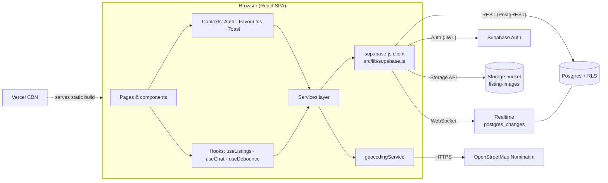
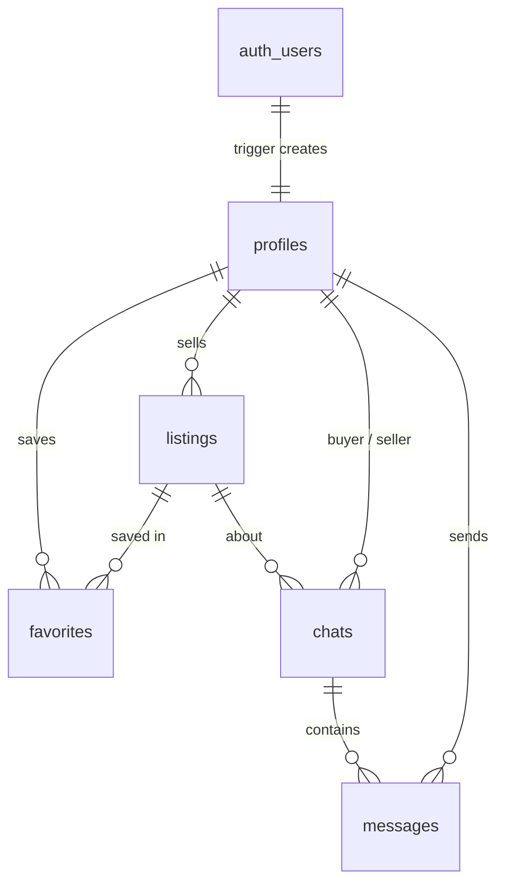

# Campus Marketplace

A student-to-student marketplace for buying and selling second-hand items on campus: textbooks, cycles, hostel essentials, electronics and more. Students post listings with photos and a meet-up spot, search and filter in real time, save favourites, and chat with sellers live.

**Live URL:** `https://<your-app>.vercel.app` _(fill in after deploying)_

---

## Features

| Area | What it does |
| --- | --- |
| **Auth** | Register / login / logout, session survives refresh, protected routes with redirect-back, editable profile |
| **Listings** | Create, view, edit, delete; title, description, ₹ price, 10 fixed categories; validation in the browser **and** in the database |
| **Images** | 1–5 photos per listing, drag-and-drop, preview, "make cover", client-side compression to WebP (max 1600 px) |
| **Mark as sold** | Greyscale image, diagonal SOLD ribbon, struck-through price, Contact Seller hidden |
| **Search & filters** | Case-insensitive search across title + description, category chips, price range, status, 3 sort orders; all done in the DB; state kept in the URL (shareable, back-button friendly) |
| **Favourites** | Optimistic heart toggle, persisted per user, auto-removed when a listing is deleted |
| **Location** | OpenStreetMap Nominatim geocoding, approximate (~100 m) coordinates, "View map" link |
| **Real-time chat** | One chat per buyer per listing, live messages, chat list re-orders on new messages |
| **Real-time feed** | New, edited, sold or deleted listings appear in other open windows without refreshing |
| **Polish** | Skeletons, empty and error states with retry, toasts, responsive from 360 px, keyboard accessible, `prefers-reduced-motion`, lazy-loaded pages |

## Tech stack

| Choice | Why |
| --- | --- |
| **React 19 + TypeScript** | Component model + type safety catch mistakes at build time |
| **Vite 8** | Instant dev server, fast production builds, built-in code splitting |
| **Tailwind CSS v4** | Consistent design tokens (`@theme`), responsive and state variants without writing CSS files |
| **React Router 8** | Nested layouts, protected routes, URL search params for filters |
| **Supabase** (Postgres, Auth, Storage, Realtime) | One managed backend: SQL constraints + Row Level Security enforce rules in the database, plus auth, file storage and websockets with no server code |
| **OpenStreetMap Nominatim** | Free geocoding with no API key; open licence |
| **Vercel** | Zero-config Vite deploys from GitHub, preview URLs per push |

## Architecture



**Rule of thumb:** components never talk to Supabase directly. They call `services/*`, which return typed data or throw; `utils/errorMessages.ts` turns any error into friendly text.

```
src/
  components/ui        Button, Input, Select, Textarea, Spinner, States, ConfirmDialog, Icons
  components/listings  ListingCard, ListingGrid, ListingForm, ImageUploader, ImageGallery, LocationField, ListingFilters, FavoriteButton
  components/chat      ChatList, ChatWindow
  context/             AuthContext, FavoritesContext, ToastContext
  hooks/               useListings (paging + realtime), useChat, useDebounce, useDocumentTitle
  layouts/             MainLayout
  pages/               Home, Login, Register, ListingDetail, CreateListing, EditListing, MyListings, Favourites, Messages, Profile, NotFound
  routes/              ProtectedRoute, GuestRoute
  services/            authService, listingService, storageService, favoriteService, chatService, geocodingService
  utils/               constants, validation, errorMessages, filters, format
supabase/migrations/   0001…0005 SQL, run in order
scripts/rls-test.mjs   Multi-account authorization test
```

## Database



| Table | Key columns | Notes |
| --- | --- | --- |
| `profiles` | `id` (= auth user id), `name`, `campus` | Created only by the `handle_new_user` trigger (no insert policy) |
| `listings` | `seller_id`, `title`, `description`, `price`, `category` (enum), `image_paths[]`, `status` (enum), `location_name`, `latitude`, `longitude` | CHECK constraints mirror the form rules; trigger locks `seller_id`/`created_at` and maintains `updated_at` |
| `favorites` | PK `(user_id, listing_id)` | Composite PK makes duplicates impossible; cascades on listing delete |
| `chats` | `listing_id`, `buyer_id`, `seller_id`, `last_message_at` | `unique(listing_id, buyer_id)`, `check(buyer_id <> seller_id)` |
| `messages` | `chat_id`, `sender_id`, `body` | Trigger bumps `chats.last_message_at` so the list re-orders |

## Authentication

Supabase Auth with email + password. `signUp` passes `name` and `campus` as user metadata; a `security definer` trigger copies them into `profiles`. `AuthContext` reads the session on start (`getSession`) and listens with `onAuthStateChange`, so the session survives a refresh and syncs across tabs. `ProtectedRoute` redirects to `/login?redirect=<path>` and returns the user afterwards (only internal paths are accepted, to avoid open redirects).

**Trade-off:** "Confirm email" is turned **off**. Supabase's built-in mailer is heavily rate-limited (a few emails per hour), which breaks demos and testing. In production you'd plug in a custom SMTP provider and turn confirmation back on; the app already handles that case ("Check your email to confirm…").

## Authorization (Row Level Security)

All tables have RLS on. The browser only ever holds the publishable key, so **the database is the security boundary**; UI checks are just for a nicer experience.

| Table | Select | Insert | Update | Delete |
| --- | --- | --- | --- | --- |
| profiles | everyone | trigger only | own row | — |
| listings | everyone | `seller_id = auth.uid()` and all image paths in own folder | own rows (same image rule) | own rows |
| favorites | own | own | — | own |
| chats | participants | buyer = me, seller = real listing owner | — | — |
| messages | chat participants | participant, `sender_id = auth.uid()` | — | — |
| storage `listing-images` | public URLs; API: own folder | own folder `<uid>/…` | — | own folder |

**Evidence:** `node --env-file=.env scripts/rls-test.mjs`

```
<paste your rls-test output here>
```

## Location API

`services/geocodingService.ts` calls Nominatim (`countrycodes=in`, 8 s timeout via `AbortController`). Coordinates are **rounded to 3 decimals (~100 m)** for privacy, and the field hint says "Use a campus landmark, not your home address." The button is disabled for 1 s after each click to respect the 1 request/second usage policy. If nothing is found or the service is down, the listing still saves without a pin. The detail page links to openstreetmap.org with "© OpenStreetMap contributors" attribution.

## Real-time

Supabase Realtime `postgres_changes` (tables added to the `supabase_realtime` publication; RLS still applies to what each user receives):

- **Marketplace feed** (`useListings`): any insert/update/delete on `listings` schedules a re-fetch of the current page range after 500 ms (debounced, so bursts cause one request).
- **Listing detail**: listens for `UPDATE` on that one row.
- **Chat** (`useChat`): `INSERT` on `messages` filtered by `chat_id`; de-duplicated by id so your own message never shows twice.
- **Chat list**: any change on `chats` (new chat or `last_message_at` bump) re-orders the list.

Every subscription is removed in the effect cleanup, and channel names get a random suffix so React StrictMode's mount→unmount→mount doesn't collide with a channel that is still closing.

## Setup

```bash
git clone <repo-url> && cd campus-marketplace
npm i
cp .env.example .env        # fill in the two VITE_ values
```

1. Create a Supabase project (region: **South Asia (Mumbai)**).
2. **SQL Editor** → run `supabase/migrations/0001_profiles.sql` … `0005_chat.sql` **in order**.
3. **Authentication → Sign In / Providers → Email**: turn **Confirm email** off.
4. **Authentication → URL Configuration**: Site URL `http://localhost:5173`.
5. `npm run dev` → http://localhost:5173

## Environment variables

| Name | Where | Purpose |
| --- | --- | --- |
| `VITE_SUPABASE_URL` | app + Vercel | Project URL |
| `VITE_SUPABASE_PUBLISHABLE_KEY` | app + Vercel | Publishable (anon) key, safe in the browser because of RLS |
| `TEST_A/B/C_EMAIL`, `TEST_A/B/C_PASSWORD` | `.env` only | Test accounts for `scripts/rls-test.mjs` |

The `service_role` / secret key is **never** used by the app.

## Deployment

1. Push to GitHub (check that `git ls-files | grep .env` shows only `.env.example`).
2. Vercel → Add New → Project → import repo (preset: Vite) → add the two `VITE_` env vars → Deploy.
3. `vercel.json` rewrites every path to `index.html` so refreshing `/listing/…` doesn't 404.
4. Supabase → Authentication → URL Configuration: Site URL = Vercel URL; keep `http://localhost:5173` in Redirect URLs.
5. Supabase → Advisors → Security Advisor: fix every warning.

## Challenges

- **Tables are exposed until RLS is on.** With a public key in the browser, any table without RLS is readable/writable by anyone. Every migration enables RLS in the same script that creates the table, and `rls-test.mjs` proves it.
- **Stray files when an upload or delete only half succeeds.** Images upload *before* the row is inserted (so we know the paths); if the insert fails, the uploaded files are removed. On delete the row goes first, then files; a file-cleanup failure is logged, not shown.
- **Duplicate real-time subscriptions under React StrictMode.** Effects run twice in dev. Each channel is removed in cleanup and gets a unique name; message handlers de-duplicate by id.
- **Delete events in real-time.** Filters don't apply to DELETE events and the payload only has the primary key, so the feed simply re-fetches on any event (debounced) instead of patching local state.
- **Nominatim's rate limit and usage policy.** 1 req/s, no autocomplete-as-you-type: lookups run only on an explicit click, with a 1 s cooldown and an 8 s timeout.
- **Search characters breaking `.or()`.** `,` `(` `)` are PostgREST syntax and `%` `_` `*` are wildcards, so they're replaced with spaces before building the filter (`a,b(c)` no longer crashes).
- **SPA page refreshes returning 404.** Fixed with the Vercel rewrite.
- **Approximate location for privacy.** Coordinates are rounded to ~100 m, and users are nudged to use a campus landmark.
- **Can't trust `seller_id` from the client.** It defaults to `auth.uid()`, RLS checks it on insert, and a trigger forces it back to the original value on update.

## Future improvements

- Unread message counts and push/email notifications
- Image moderation and report-a-listing flow
- Campus-verified sign-up (college email domains) with custom SMTP
- Offers / price negotiation, seller ratings
- Map view of nearby listings, distance sorting with PostGIS
- Full-text search with `pg_trgm` / `tsvector` at larger scale
- Profile photos (an `avatars` bucket with the same own-folder policies)

## Scripts

| Command | Purpose |
| --- | --- |
| `npm run dev` | Dev server |
| `npm run build` | Type-check + production build |
| `npm run preview` | Serve the production build locally |
| `npm run lint` | oxlint |
| `node --env-file=.env scripts/rls-test.mjs` | Authorization tests |
